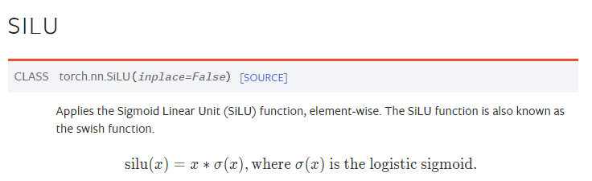
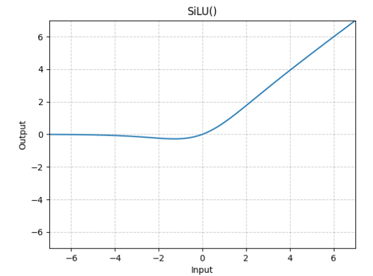
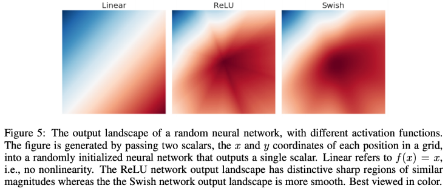

## DDPM

- Hugging Face에서 잘 정리를 해두어, 한글로 정리하면서 코드를 공부하였습니다. 
- 링크 : https://huggingface.co/blog/annotated-diffusion

## 결과 

   

## 수학 모를 때 도움이 된 곳들
- ELBO : https://hugrypiggykim.com/2018/09/07/variational-autoencoder%EC%99%80-elboevidence-lower-bound/
- MLE : https://bubilife.tistory.com/33
- NLL : https://gaussian37.github.io/dl-concept-nll_loss/

## 혼자 스터디(22/12/01)

### Q1) Training 시 object function
- ϵ과 ϵ_θ의 loss를 계산하는 것은 실제 forward 과정을 거쳐 나온 t 시점에서의 알려진 noise와 t=T에서부터 reverse과정을 거쳐서 나온 nerual net을 통해 나온 추측된 noise사이의 loss function을 계산하는 것 같다.

### Q2) SILU
- 처음 사용해본다.
- Simgoid Linear Unit : 시그모이드 함수에 입력값을 곱한 함수

   

 

   

 
- 기존의 activation보다 훨씬 부드럽게 구성되어 있다. 

 

   

